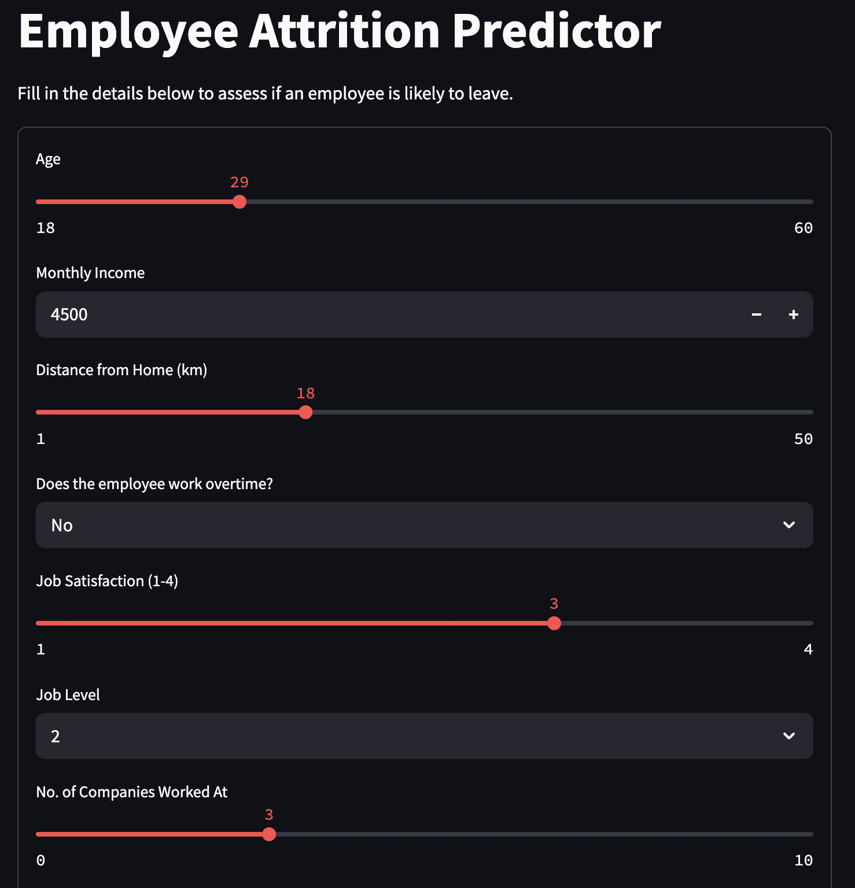
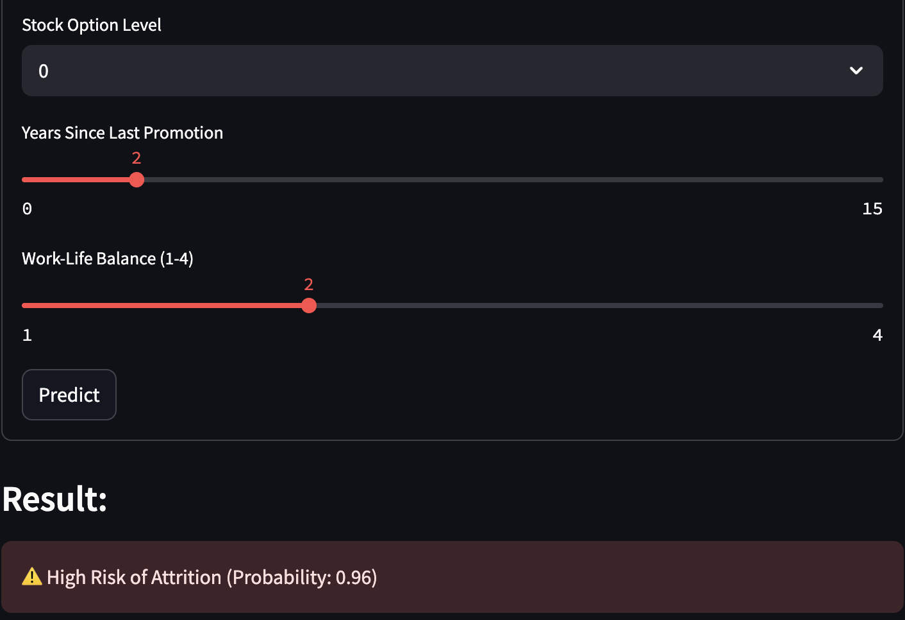
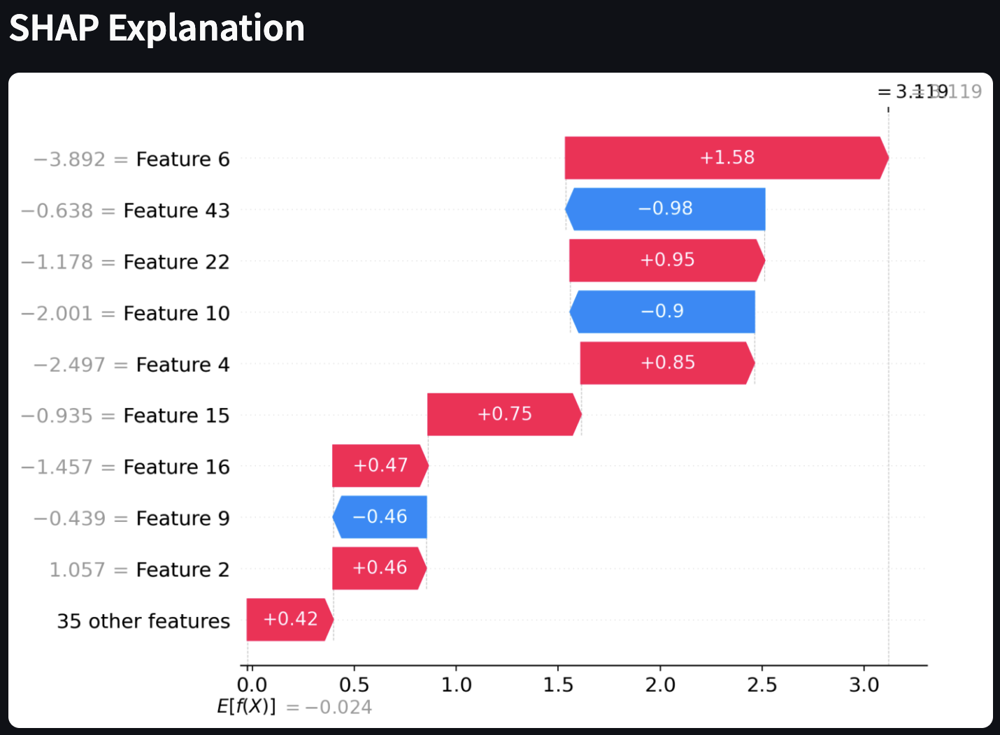

# 💼 HR Attrition Predictor

An interactive, explainable machine learning app to predict whether an employee is at risk of attrition. Built using Streamlit, XGBoost, and SHAP for real-time predictions with interpretability.

---

## 🚀 Live Demo

[Click here to try the app](https://hr-attrition-predictor-acme6nm34kgx8yvxz3yvvq.streamlit.app/)

---

## 📊 Project Overview

This project uses IBM’s HR Analytics dataset to:
- Predict employee attrition using machine learning
- Visualize key features driving each prediction with SHAP
- Provide an interactive UI for HR teams via Streamlit

---

## 🧠 Model Details

- **Algorithm:** XGBoost Classifier
- **Handling Imbalance:** SMOTE (Synthetic Minority Oversampling)
- **Explainability:** SHAP (SHapley Additive exPlanations)
- **Key Features:** OverTime, JobSatisfaction, DistanceFromHome, StockOptionLevel

---

## 📸 Screenshots

| Form Input | Prediction Output | SHAP Explanation |
|------------|-------------------|------------------|
|  |  |  |

---

## 🖥️ How to Run Locally

### 1. Clone this repo:
```bash
git clone https://github.com/shauryadata/hr_attrition_predictor.git
cd hr_attrition_predictor


